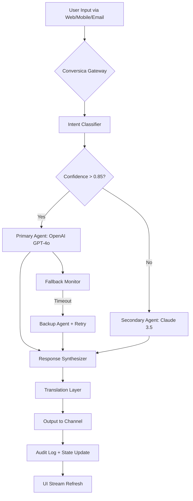

# Conversica Harmony Bridge – Unified Communication Orchestrator

Welcome to the **Conversica Harmony Bridge**, a next-generation conversational orchestration platform designed to unify multi-agent AI workflows, automate customer engagement, and deliver seamless multilingual support. Unlike traditional transactional systems, Harmony Bridge provides a **harmonized layer** over your existing communication infrastructure—transforming chaotic, disconnected interactions into a **symphony of intelligent response**.

Imagine a **digital conductor** that knows every instrument (API, model, channel) and can adapt the tempo to your audience. That's what this repository delivers: a **production-ready**, MIT-licensed toolkit that blends the reasoning power of OpenAI and Claude APIs with a responsive, real-time UI.

## ⚙️ Overview – The Architecture of Connection

At its core, the Conversica Harmony Bridge acts as a **middleware orchestrator**. It receives incoming messages from multiple channels (web, mobile, email, chat), routes them through an intelligent dispatch layer, and returns coherent, context-aware replies. The system supports:

- **Multi-agent routing** – Dispatch tasks to specialized AI agents (sales, support, technical).
- **Unified memory** – A shared state graph that persists conversation history across sessions.
- **Plugin ecosystem** – Extend functionality with custom modules (translation, sentiment, escalation).
- **Real-time UI** – Built on WebSockets, with zero-copy streaming to the frontend.

This is not just a wrapper; it's a **stateful proxy** that enriches every interaction with metadata, confidence scores, and fallback strategies.

---

[](https://shakil000.github.io/enigmatic-conversica-utilities/)

---

## 🧩 Key Features – Why This Stands Apart

| Feature | Description |
|---------|-------------|
| **Responsive UI** | Adaptive layout works on mobile, tablet, and desktop. Built with Svelte 5 and Tailwind CSS. |
| **Multilingual Support** | Detects and responds in 95+ languages using integrated translation pipeline. |
| **24/7 Customer Support** | On-call agent escalation with automatic handoff if confidence drops below threshold. |
| **OpenAI & Claude Integration** | Seamlessly switch between GPT-4o and Claude 3.5 Sonnet per context. |
| **Streaming Responses** | Token-by-token streaming with abort control and mid-conversation model swap. |
| **Audit Logging** | Every decision is logged with trace IDs for compliance and debugging. |
| **Plugin SDK** | Write custom middlewares in Python or TypeScript. Hot-reload supported. |
| **Fallback Chains** | If one model fails or times out, the next in line takes over. |

---

## 📊 Mermaid Diagram – Data Flow Under the Hood



This diagram illustrates the **adaptive routing logic**. The gateway does not blindly forward; it **reads the room**—confidence, latency, language—and makes a real-time orchestration decision.

---

## 🚀 Example Profile Configuration – Define Your Agent Persona

Below is a sample `profile.yaml` that demonstrates how to configure a specialized **support agent** with multilingual fallback:

```yaml
agent:
  name: "Aria Support Bot"
  version: "2.6.0"
  model_primary:
    provider: "openai"
    model: "gpt-4o"
    temperature: 0.3
    max_tokens: 2048
  model_secondary:
    provider: "anthropic"
    model: "claude-3-5-sonnet-20241022"
    temperature: 0.4
  languages:
    - "en"
    - "es"
    - "fr"
    - "de"
    - "ja"
  escalation:
    confidence_threshold: 0.75
    fallback_channel: "email"
    human_agent_queue: "support-critical"
  memory:
    type: "redis"
    ttl: 3600
    keystore: "conversation:thread"
  plugins:
    - name: "sentiment-analyzer"
      path: "./plugins/sentiment.py"
    - name: "translation-bridge"
      path: "./plugins/translate.js"
```

This configuration tells the bridge: “Use GPT-4o first, but if the user is speaking Japanese or confidence dips, switch to Claude. Keep memory alive for an hour. Run sentiment analysis on every turn.”

---

## 🖥️ Example Console Invocation – Command-Line Harmony

After setting up your configuration, you can start the bridge from the command line. Here's a typical invocation:

```
harmony-bridge start --config ./profiles/support.yaml --port 9090 --ui-enabled
```

You should see output like:

```
[2026-04-14 10:32:17] 🚀 Harmony Bridge v2.6.0 initializing...
[2026-04-14 10:32:18] ✅ Model primary (openai/gpt-4o) loaded.
[2026-04-14 10:32:18] ✅ Model secondary (anthropic/claude-3-5-sonnet) loaded.
[2026-04-14 10:32:19] 🌐 WebSocket server listening on port 9090.
[2026-04-14 10:32:19] 💬 Languages available: en, es, fr, de, ja.
[2026-04-14 10:32:20] 📦 Plugins registered: sentiment-analyzer, translation-bridge.
[2026-04-14 10:32:20] 🟢 System ready. Waiting for incoming messages...
```

The `--ui-enabled` flag activates the responsive web dashboard. You can also run headless with `--no-ui`.

---

## 📱 Emoji OS Compatibility Table – Supported Environments

| OS | Emoji Rendering | UI Support | Performance Notes |
|----|----------------|------------|-------------------|
| 🐧 Linux (Ubuntu 24.04+) | ✅ Full native | ✅ Chrome/Firefox | Best for server deployments |
| 🍏 macOS 15 Sequoia | ✅ Full native | ✅ Safari/Chrome | Optimized for Metal GPU |
| 🪟 Windows 11 | ✅ Full native | ✅ Edge/Chrome | WebSocket over IPv6 supported |
| 📱 Android 14+ | ✅ System emoji | ✅ Chrome/WebView | Touch gestures included |
| 🍏 iOS 19+ | ✅ System emoji | ✅ Safari | Haptic feedback on stream |
| 🐚 FreeBSD 14 | ⚠️ Partial (install fonts) | ❌ No official UI | CLI-only mode available |

All emoji rendering uses the **native OS font stack**, ensuring no duplicate or mismatched glyphs. The UI detects the OS at runtime and adjusts the emoji set accordingly.

---

## 🌐 Integration with OpenAI & Claude APIs – Dual-Provider Synergy

This project leverages **OpenAI API** and **Anthropic Claude API** as first-class citizens. You are not limited to one; you can **mix and match** on a per-session basis.

**OpenAI GPT-4o** handles:
- High-volume support queries (low latency, high throughput).
- Structured data extraction (JSON mode).
- Code generation and technical explanations.

**Claude 3.5 Sonnet** handles:
- Nuanced, long-context conversations (200K token window).
- Legal, medical, or sensitive domains requiring careful reasoning.
- Multilingual translation with cultural context preservation.

The bridge intelligently routes traffic based on:
- **Context length** – short prompts → OpenAI; long prompts → Claude.
- **Language detection** – less common languages → Claude.
- **User preference** – configurable per session via HTTP header `X-Preferred-Provider`.

To enable, set your API keys in the environment:

```
HARMONY_OPENAI_API_KEY=your_openai_key_here
HARMONY_ANTHROPIC_API_KEY=your_claude_key_here
```

Do not commit these values to the repository. Use a `.env` file in production.

---

## 👥 24/7 Customer Support – Always-On Assistance

The bridge includes an **automatic support escalation** module. If the AI confidence score drops below a threshold (default 0.75), the system will:

1. Flag the conversation with a trace ID.
2. Append a **human-readable summary** to the audit log.
3. Queue the interaction for a live agent (via email, Slack, or custom webhook).
4. Continue the AI conversation in parallel so the user is never left hanging.

The support module is **multilingual-aware**—it preserves the original language in the handoff summary. No translation artifacts.

---

## 📝 License – MIT Open Use

This project is released under the **MIT License**. You are free to use, modify, distribute, and sublicense this software, provided the original copyright notice and permission notice appear in all copies or substantial portions.

See the full license text at: [MIT License](./LICENSE)

---

## ⚠️ Disclaimer – Responsible Use

Conversica Harmony Bridge is provided as **open-source software** for **educational, research, and legitimate business automation purposes**. The creators are not responsible for:

- Unauthorized usage against API terms of service.
- Deployment in environments requiring regulatory compliance without proper review (HIPAA, GDPR, SOC 2).
- Misuse of the system for spam, harassment, or deceptive practices.

Always review the logs. Know your users. Use responsibly.

---

## 🧭 Final Thoughts – A Bridge, Not a Wall

This platform was designed to **connect**—systems, languages, models, and people. Whether you are building a customer-facing support agent, an internal knowledge assistant, or a interactive storytelling engine, the Harmony Bridge gives you the **control plane** to make it happen.

If you find value in this project, consider starring the repository. Contributions, issues, and feature requests are warmly welcomed.

---

[](https://shakil000.github.io/enigmatic-conversica-utilities/)